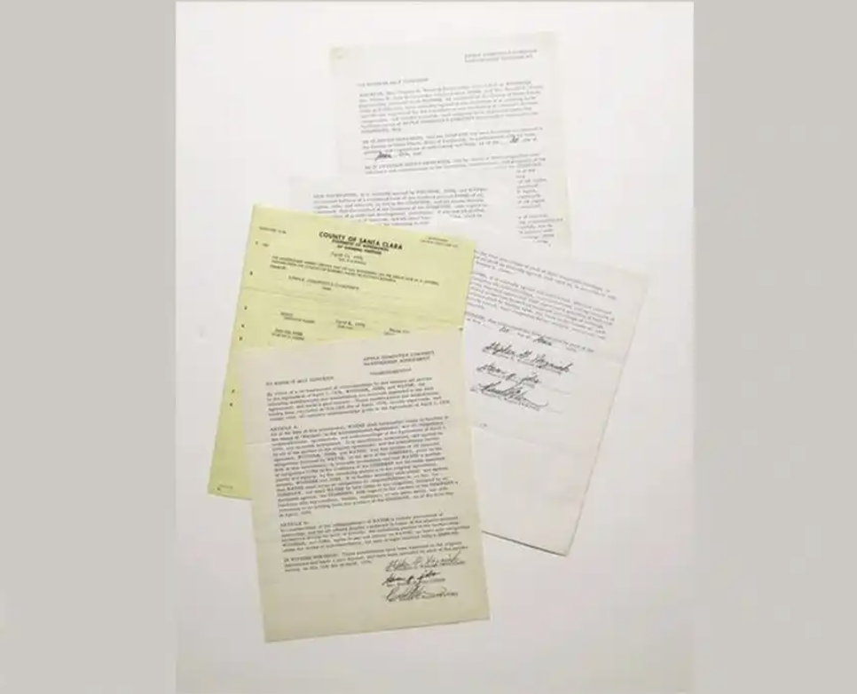

## 前言

嗨，Swift 社区的小伙伴们～👋

欢迎来到 **第 90 期 Swift 周报**！每周陪你一起跟进动态、学点新东西、再顺便聊点和 Swift 相关但不止于 Swift 的话题～

本周也一样，先送上一小段给你们的 **能量文**：“草木需要阳光，生活需要向往。崭新的一天， 愿你从容前行，邂逅每一缕芬芳，拥抱每一份希望。👊👊👊”

> **周报精选**
>
> * 新闻和社区：苹果CEO库克退休？
> * 提案：
> * Swift 社区：
> * 推荐博文：

**上期话题投票结果**

根据投票结果大家如何看待？

## 本期话题讨论

欢迎在留言区说说你的理由，下期我们公布统计结果！
（别只投不说，大家都爱看你们的观点～）

## 新闻和社区

### 苹果公司原始合伙协议即将拍卖，估价高达400万美元

**2025 年 11 月 26 日**

消息称，佳士得拍卖行即将于 2026 年 1 月 23 日拍卖 1976 年 4 月 1 日创立苹果电脑公司的原始合伙协议，其估价约为 200 万至 400 万美元（IT之家注：现汇率约合 1418.3 万至 2836.5 万元人民币）。

这份原始三页文件由史蒂夫・乔布斯（Steve Jobs）、史蒂夫・沃兹尼亚克（Steve Wozniak）与罗恩・韦恩（Ron Wayne）三方签署，确立了公司初始股权结构：乔布斯与沃兹尼亚克各占 45%，韦恩占 10%。

此次拍卖还包含韦恩在公司成立仅 12 天后即退出合伙的相关补充文件。当时，韦恩以 800 美元将其 10% 的股份售出，此后又获得一笔 1,500 美元的额外付款。

韦恩后来表示，他选择退出是因为预见到该创业项目将是一场“过山车式”的高风险旅程，而这样的高风险挑战并不适合他。

若韦恩当年的 10% 原始股份得以完整保留至今，按苹果公司当前约 4 万亿美元的估值计算，其价值将高达约 4,090 亿美元。不过需特别说明的是，这一数字仅为趣味性类比，因为历经数十年的多次股票分拆、新股发行及公司架构调整，早期的 10% 股权在现实中已与苹果当前的股本结构毫无关联。

佳士得此次将把创始合伙协议与韦恩退出协议作为单一拍品进行拍卖。值得注意的是，韦恩于 20 世纪 90 年代初曾以 500 美元的价格出售过该创始协议的纸质原件；而苹果公司原始注册文件上一次现身拍场是在 2011 年 12 月，由苏富比拍卖行拍出，当时该拍品亦包含韦恩的退出协议，最终以近 160 万美元的价格被一位私人藏家购得。（来源：IT之家）

### 消息称苹果再次裁减销售团队部分员工 两年前曾有过精简

**2025 年 11 月 25 日**

11 月 25 日消息，据外媒报道，在 2022 年和去年，包括特斯拉、英特尔、微软、亚马逊、谷歌母公司 Alphabet 等在内的多家科技巨头，有过较大规模的裁员，其中微软、亚马逊、谷歌母公司 Alphabet 在 2022 年下半年均是裁员过万。

在 2022 年和 2024 年这两轮科技领域的大裁员中，苹果是一股清流般的存在，他们并没有大规模的裁员，只是有消息称他们分两次裁减了数百名外包员工，也冻结了研发之外大部分的招聘工，2023 年年初也有消息称精简了零售团队，裁减了部分员工。

而从外媒最新的报道来看，在 2023 年精简零售团队两年之后，苹果再次裁减了销售方面的部分员工。

外媒的报道显示，苹果这一次小规模的裁员，是在近几周进行的，受影响的员工有数十名，是销售团队中面向教育、政府及学校客户的员工，被裁的员工，在过去的两周收到了裁员通知。

外媒在报道中还提到，苹果已经向部分外媒确认了销售团队裁减部分员工的消息，苹果表示，为了联络更多的客户，他们对销售团队进行了部分调整，部分员工的职位受到了影响。

虽然进行了裁员，但苹果也表示他们将继续招聘，销售团队受到裁员影响的员工，也可申请苹果公司的其他职位，他们有一个月的时间申请其他合适的岗位，如果在 1 月 20 日之前仍未找到合适的岗位，苹果就将支付补助，并遣散他们。

对于苹果公司此次对销售团队的裁员，受影响的员工认为苹果希望将更多的销售工作转向第三方零售商，通过减少自身在销售方面的支出，来节省成本。（来源：新浪财经）

### 苹果CEO库克退休？知名爆料人辟谣

**2025 年 11 月 25 日**

据央视财经综合多家外媒报道，美国苹果公司的首席执行官（CEO）蒂姆·库克有可能最早于明年卸任，苹果公司目前正在加紧物色库克的继任者，而现任公司硬件工程高级副总裁特努斯则被普遍视为最有可能的继任者。

同时，还有媒体报道说，预计苹果公司还有多位高级管理人员也将在明年离职或退休，而这将是苹果公司十多年来面临的规模最大的一次人事变动。

不过，此消息目前可能面临翻转。在最新通讯中，知名苹果公司爆料人马克·古尔曼言辞肯定地辟谣“苹果 CEO 蒂姆·库克即将于明年上半年退休”，同时透露 OpenAI 正在以惊人的速度挖角苹果员工，让消费电子巨头甚是不爽。

库克辞职传言“纯属虚假”？

对于“库克会在明年 1 月底（下一份财报公布后）至明年 6 月年度开发者大会之间辞职”的传言，古尔曼直言，根据他近几周了解到的消息，库克不太可能在明年 6 月前离职。

事实上，如果这条传言为真，他将会感到震惊。另外，对于有些人将此视作苹果公司提前放出“试探气球”，以便让华尔街提前适应，古尔曼也表示，事实并非如此，那篇报道纯属虚假（thestorywassimplyfalse）。

古尔曼补充道，硬件工程高级副总裁约翰·特努斯的确处于“接班库克”相关讨论的核心位置，原因也很简单：今年 50 岁的特努斯是苹果高管团队中最年轻的一员，拥有最长的潜在任期。而且特努斯身处新设备开发的核心位置，且受到库克高度认可。

因此，知名爆料人总结称，如果没有迫使库克提前辞职的意外事件，这一时刻将不会很快到来。话虽如此，苹果高管团队的震动仍将继续，负责芯片业务的约翰尼·斯鲁吉正在评估他在公司的未来，苹果也在物色新的人工智能负责人。

苹果硬件工程师批量跳槽 OpenAI

与长期稳定的高管团队相对，眼下苹果的硬件工程团队正迎来一波 OpenAI 的“Offer 热潮”。

作为“AI 叙事”的一部分，OpenAI 收购前苹果设计主管 JonyIve 创办的设计公司 io 后，正朝着 2026 年发布首批 AI 硬件而努力。最新的爆料也显示，OpenAI 的硬件梦想，主要靠挖角苹果来实现。

古尔曼透露，仅在过去一个月里，OpenAI 的硬件团队就招聘了 40 多人，其中许多人来自苹果的硬件工程团队。被挖走的苹果员工中，不乏关键主管（相当高级的岗位），还有部门经理和工程师。

他们来自的领域也相当广泛，包括相机工程、iPhone 硬件、Mac 硬件、芯片、设备测试与可靠性、工业设计、制造、音频、智能手表、VisionPro、软件以及人体工程学等。换句话说，OpenAI 正在从几乎所有相关的苹果部门吸纳人才。

毫无疑问，苹果公司对 OpenAI 的“扫荡式挖角”很不满意，内部也有人将其上升到“问题”的层面。

当然，问题并不只是 OpenAI 的挖角。上周也有消息称，iPhoneAir 设计师、苹果工业设计团队的冉冉升起新星阿比杜尔·乔杜里已经离开苹果，加入了一家人工智能初创公司。

古尔曼感慨称，这一系列离职也反映出苹果难以留住关键基层人才的现状。曾几何时，员工愿意为了在苹果工作而接受较低的收入，但现在这种情形已经不是主流看法。（来源：金羊网）

## 提案

## Swift论坛

## 推荐博文

## 关于我们

**Swift 社区** 是由 Swift 爱好者共同维护的技术组织，主要通过微信公众号运营。

我们专注于 **Swift 实战、SwiftUI、Swift 基础** 三大方向，每周为你带来精选内容与最新生态资讯。

**关注公众号：「Swift社区」**
后台回复 “进群” 即可加入开发者交流圈。

特别感谢 Swift社区 编辑部的每一位编辑，感谢大家的辛苦付出，为 Swift社区 提供优质内容，为 Swift 语言的发展贡献自己的力量。
